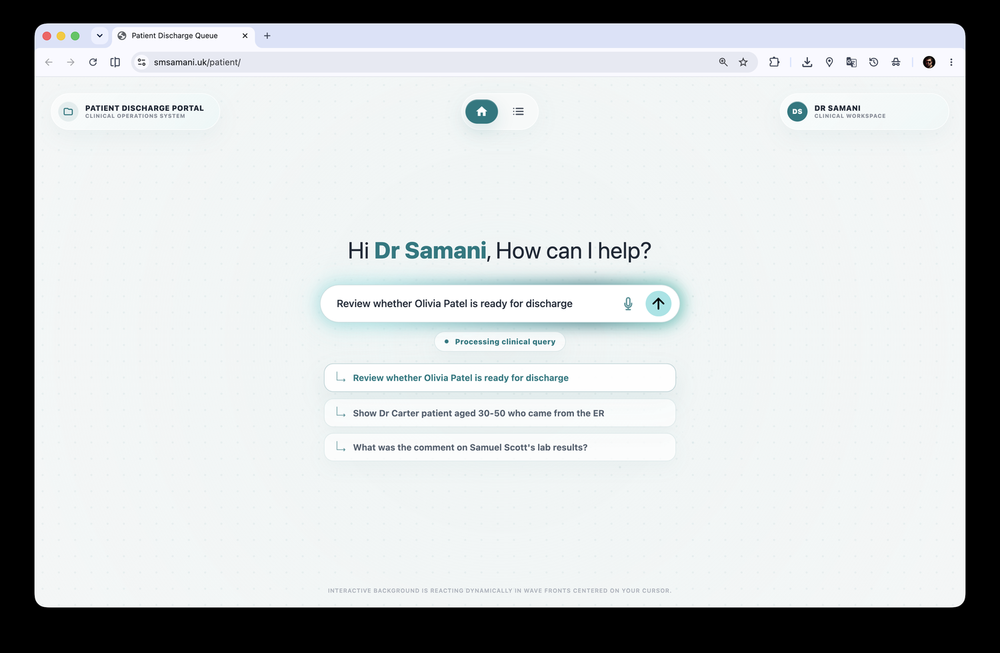
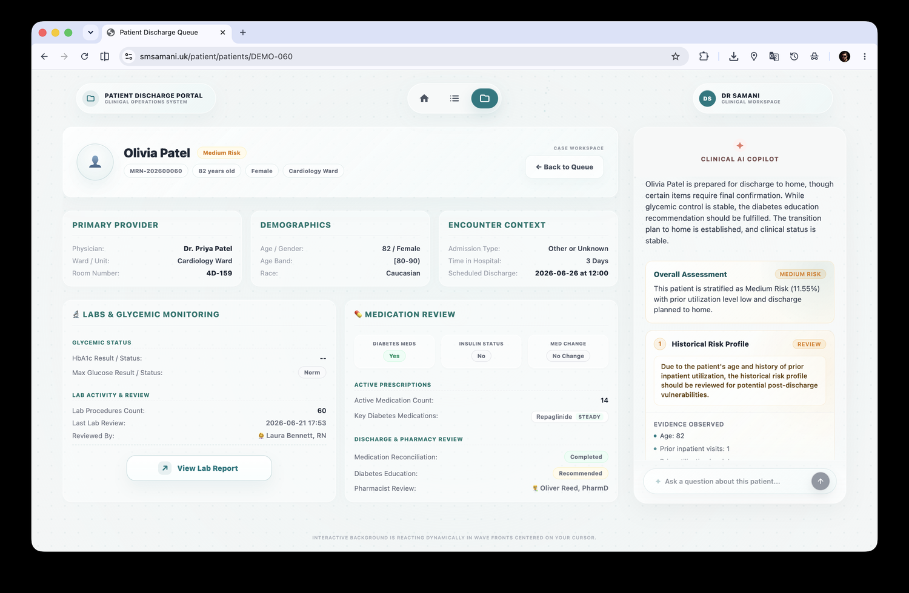
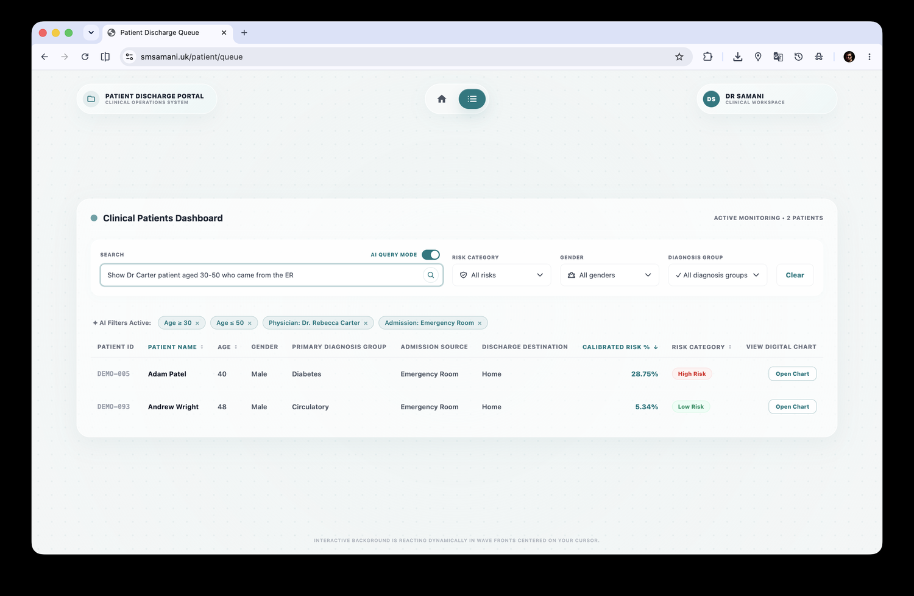

# Patient Readmission Risk Prediction

> 🚀 **Start here:** for the fastest way to understand the story, design thinking, and live product experience, open the project walkthrough first:  
> **[www.smsamani.uk/#/project-discharge](https://www.smsamani.uk/#/project-discharge)**  
> It explains the problem, stakeholder needs, AI copilot workflow, dashboard experience, and why this project matters before you dive into the code.

A machine learning and clinical decision-support project for predicting 30-day hospital readmission risk in diabetes patient encounters. The repo combines predictive modeling, SQL analytics, SHAP explainability, Tableau-style executive reporting, and a full-stack clinical web demo for reviewing patient risk profiles.

This is not just a notebook project. It is built like a small clinical intelligence product: model outputs become patient queues, SHAP drivers become evidence cards, and risk predictions become discharge-planning conversations.

## What This Project Does

Hospital readmissions are expensive, operationally painful, and often preventable when high-risk patients are identified early. This project asks a practical question:

> Can hospitals identify high-risk diabetic patients before discharge, explain why they are high-risk, and give care teams a better review workflow?

The system includes:

- 🧠 **30-day readmission risk modeling** for diabetes patient encounters
- 🧹 **Feature engineering** for clinical, utilization, medication, diagnosis, and lab signals
- 📊 **SQL analysis** for operational and financial readmission patterns
- 🔍 **SHAP explainability** so model predictions are not black boxes
- 📈 **BI/dashboard assets** for hospital-manager style reporting
- 🩺 **Clinical patient portal** for discharge planners and care coordinators
- ✨ **AI-assisted copilot flows** for patient search, chart navigation, and evidence-grounded discharge review

## Key Results

The best XGBoost model improved over the earlier baseline while maintaining clinically useful recall for the readmitted class.

| Model | ROC-AUC | PR-AUC | Recall | F1-score |
| --- | ---: | ---: | ---: | ---: |
| Logistic Regression | 0.652 | 0.207 | 0.535 | 0.264 |
| XGBoost Default | 0.677 | 0.229 | 0.590 | 0.278 |
| XGBoost Tuned | 0.677 | 0.228 | 0.567 | 0.281 |
| Random Forest | 0.666 | 0.216 | 0.506 | 0.274 |
| LightGBM | 0.674 | 0.227 | 0.563 | 0.278 |

The final pipeline was trained on **99,340 cleaned encounters**. Important risk drivers included prior inpatient utilization, discharge disposition, total prior utilization, age, number of diagnoses, time in hospital, diagnosis group, medication count, and lab procedure volume.

## Product Thinking

The project is designed around two main stakeholder groups:

- 🏥 **Hospital managers** need aggregate trends, financial exposure, high-burden groups, and resource allocation signals.
- 👩‍⚕️ **Discharge planners** need patient-level prioritization, explainable risk, clinical drivers, and practical review prompts before discharge.

That split shaped the whole project: the model predicts risk, SQL explains population patterns, SHAP explains patient-level drivers, and the web app turns all of it into a usable workflow.

## Repository Structure

```text
.
├── SQL/                         # SQL queries for clinical and operational analysis
├── dashboard/                   # Tableau packaged workbook and dashboard screenshots
├── figures/                     # Model evaluation and explainability visualizations
├── model_outputs_cpu/           # Lightweight model result tables
├── model_outputs_islam_stacking_cpu/
│   └── *.csv                    # Stacking experiment summaries
├── models/                      # Training scripts, excluding serialized model binaries
├── notebooks/                   # EDA, preprocessing, modeling, and rebuild notebooks
├── reports/                     # Written SQL findings
├── results/                     # Final metrics, thresholds, predictions, and SHAP summaries
└── src/                         # Reusable Python pipeline modules
```

## Machine Learning Workflow

1. Clean and prepare encounter-level diabetes admission data.
2. Engineer readmission-focused features from utilization, diagnoses, medications, labs, and encounter context.
3. Train multiple classifiers, including Logistic Regression, Random Forest, XGBoost, LightGBM, and stacking experiments.
4. Compare models with ROC-AUC, PR-AUC, recall, F1-score, confusion matrices, and threshold sensitivity.
5. Explain predictions using SHAP global importance and patient-level feature contribution summaries.

The repository intentionally excludes serialized `.pkl` model files so the project remains lightweight and safe for GitHub. Models can be regenerated from the included scripts when the source data is available.

## SQL Analysis

The `SQL/` directory contains analysis queries covering:

- Baseline readmission penalty analysis
- Age group risk patterns
- A1C testing gaps
- Diagnosis group readmission burden
- Prior utilization and readmission risk
- Tableau-ready dataset preparation

The written SQL findings are available in `reports/SQL_Findings_Report.md`.

## Visual Outputs

The `figures/` directory includes:

- ROC curve
- Precision-recall curve
- Confusion matrix
- Calibration curve
- SHAP global importance
- SHAP beeswarm plot

The `dashboard/` directory includes a Tableau packaged workbook and dashboard screenshots.

## Python Environment

Install the core Python dependencies from the project root:

```bash
pip install -r requirements.txt
```

Training scripts that expect the final encoded dataset can use:

```bash
export DIABETES_ML_DATASET="data/processed/diabetes_final_ml_dataset_encoded.csv"
python models/train_models_cpu.py
```

## Web Demo

🧪 **Test the live demo:** [www.smsamani.uk/patient/](https://www.smsamani.uk/patient/)

| Project story | Patient queue | Clinical AI copilot |
| --- | --- | --- |
|  |  |  |

## Data and Artifact Policy

This repository is prepared as a clean GitHub release. The following files are intentionally excluded:

- Raw and processed datasets
- Local SQLite databases
- Serialized `.pkl` and `.joblib` model artifacts
- Virtual environments, caches, build outputs, and OS metadata
- Secret files such as `.env`
- Local-only Tableau temporary files

This keeps the repository small, reproducible, and safe to share.

## Limitations

This project is a research and portfolio implementation, not a deployed medical device. Predictions should not be used as the sole basis for clinical decisions. Model performance depends on the source data, preprocessing assumptions, feature availability, and local validation in the target care setting.

## License

This project is released under the MIT License.
